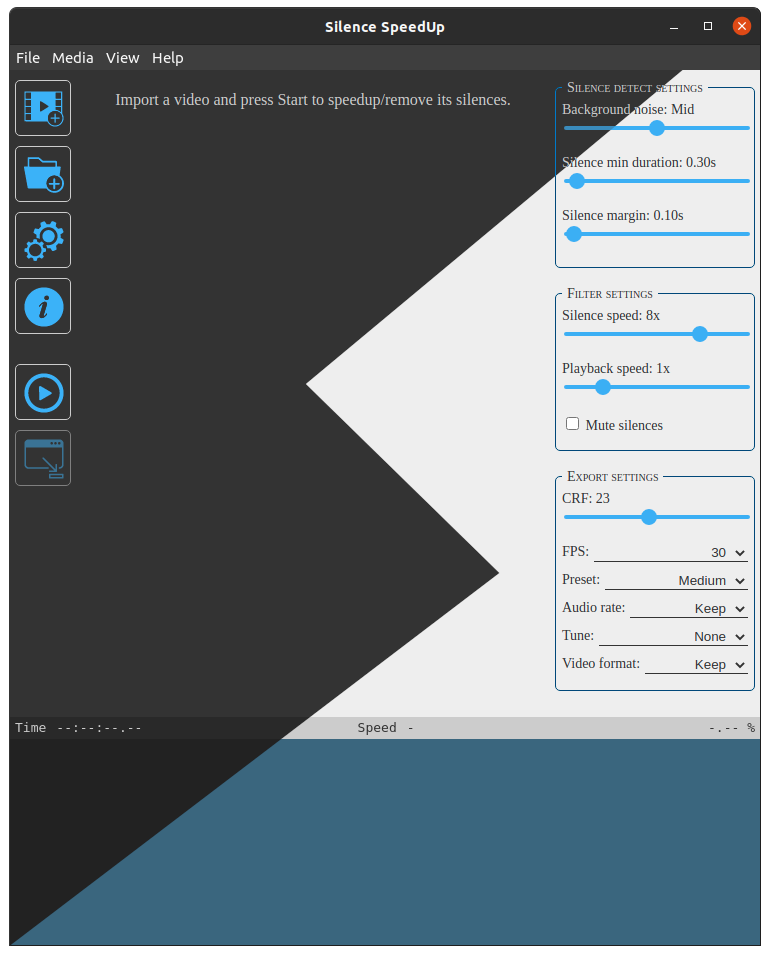

# Silence Speedup
Velocizza i tuoi video velocizzando (o rimuovendo) i silenzi, tramite FFmpeg.



*Leggi in altre lingue: [Inglese](README.md), [Italiano](README.it.md).*

## Indice dei contenuti
  - [Per iniziare](#per-iniziare)
    - [Download](#download)
      - [FFmpeg incluso](#ffmpeg-incluso)
      - [FFmpeg non incluso](#ffmpeg-non-incluso)
    - [Utilizzo](#utilizzo)
    - [Configurazioni](#configurazione)
      - [Rilevamento silenzi](#rilevamento-silenzi)
      - [Filtri](#filtri)
      - [Esportazione](#esportazione)
    - [Requisiti](#requisiti)
  - [Compilazione](#compilazione)
  - [Come funziona](#come-funziona)
    - [Note](#note)
  - [Contribuire](#contribuire)
  - [Crediti](#crediti)

## Per iniziare
Questo programma, sviluppato per Electron, fa uso di FFmpeg per velocizzare (o saltare) i silenzi presenti nei video.

È molto utile per le video lezioni, in cui un professore impiega molto tempo per scrivere qualcosa alla lavagna, fa molte pause o parla lentamente. Con questo programma puoi saltare queste parti noiose e risparmiare tempo.

Ovviamente questo programma non è perfetto e potresti dover esercitarti un po' con esso.

### Download

#### FFmpeg incluso
* [Windows](https://github.com/padvincenzo/silence-speedup/releases/download/v1.2.0/Silence-SpeedUp-v1.2.0-win32-ia32-standalone.zip) (97.1 MB)
* [MacOS](https://github.com/padvincenzo/silence-speedup/releases/download/v1.2.0/Silence-SpeedUp-v1.2.0-darwin-x64-standalone.zip) (245 MB)
* [Linux](https://github.com/padvincenzo/silence-speedup/releases/download/v1.2.0/Silence-SpeedUp-v1.2.0-linux-x64-standalone.zip) (101 MB)

#### FFmpeg non incluso
* [Windows](https://github.com/padvincenzo/silence-speedup/releases/download/v1.2.0/Silence-SpeedUp-v1.2.0-win32-ia32.zip) (72 MB)
* [MacOS](https://github.com/padvincenzo/silence-speedup/releases/download/v1.2.0/Silence-SpeedUp-v1.2.0-darwin-x64.zip) (223 MB)
* [Linux](https://github.com/padvincenzo/silence-speedup/releases/download/v1.2.0/Silence-SpeedUp-v1.2.0-linux-x64.zip) (74.1 MB)

### Utilizzo
Importa i tuoi video, scegli la [configurazione](#configurazioni) e premi ``Start``. L'app ti mostrerà lo stato di avanzamento, che consiste in 3 step: ``Detecting silences``, ``Exporting`` e ``Concatenating``.

### Configurazioni
Non tutti i video hanno lo stesso livello di volume, e potresti voler scegliere quali silenzi devono essere trattati come tali. Quindi, ecco le parti configurabili.

#### Rilevamento silenzi
Queste impostazioni cambiano il modo in cui FFmpeg rileva i silenzi. Puoi impostare:

* Il rumore di fondo del video (``Low`` per una stanza silenziosa con microfono, ``Mid`` per una stanza mediamente rumorosa, ``High`` per una stanza rumorosa). Nota: se sei nuovo, prova un video con le impostazioni predefinite e guarda il risultato.

* Quanti secondi dura il più piccolo silenzio (questo valore evita che brevi pause siano considerate silenzi).

* Quanti secondi di silenzio non devono essere trattati come silenzi (spiegazione: senza un tempo minimo di margine, le parole pronunciate potrebbero fondersi e il risultato sarebbe un discorso incomprensibile).

#### Filtri
Con queste impostazioni è possibile modificare la velocità delle parti parlate/silenziose del video, e anche impostare le parti silenziose in modo che siano solo video.

#### Esportazione
Scegli il formato (estensione) del tuo video. Per impostazione predefinita mantiene la stessa estensione. In questo modo, ho notato che alcuni formati (ad esempio ``avi``) perdono la qualità del video durante il processo.

Nota: il percorso predefinito dei video (così come dei file temporanei) è impostato su ``<la tua home>/speededup/``. Se vuoi cambiarlo, premi il pulsante delle impostazioni o vai su ``File -> Impostazioni``.

### Requisiti
Questa app è rilasciata in 2 varianti: quella chiamata standalone ha al suo interno i binari di FFmpeg e perciò non richiede nulla per essere eseguita. L'altra variante non include FFmpeg: devi scaricarlo e configurarlo manualmente.

## Compilazione
Questo programma non ha bisogno di essere installato per funzionare, poiché è impacchettato con [``electron-packager``](https://electron.github.io/electron-packager/master/). Ma, se vuoi compilare ed eseguire questo programma per conto tuo dal codice sorgente, allora:

```
$ git clone https://github.com/padvincenzo/silence-speedup
$ cd silence-speedup
$ npm install
$ npm start
```

Se desideri eseguire questo programma dal codice sorgente hai bisogno di installare [NodeJS](https://nodejs.org/en/).

## Come funziona
Per ogni video, questo programma:

1. Eseguirà ffmpeg con il filtro ``silencedetect``, per ottenere l'elenco dei timestamp di inizio/fine dei silenzi.

```
<ffmpeg bin> -hide_banner -vn \
  -ss 0.00 -i <Input file> \
  -af silencedetect=n=<threshold>:d=<duration> \
  -f null -
```

2. Usando quell'elenco, dividerà il video originale dentro una cartella tmp, applicando un filtro di velocità, se presente.

```
<ffmpeg bin> -hide_banner -loglevel warning -stats \
  -ss <Start time> -to <End time> -i <Input file> \
  -filter_complex "[0:v]<setpts filter>[v];[0:a]<atempo filter>[a]" \
  -map [v] -map [a] <Output fragment>
```

3. Concatena tutti i frammenti generati precedentemente.

```
<ffmpeg bin> -hide_banner -loglevel warning -stats \
  -f concat -safe 0 \
  -i <Fragment list file> \
  -c copy \
  -map v -map a <Output file> -y
```

### Note
Al termine dell'esecuzione, il programma non pulisce automaticamente la cartella tmp.

## Contribuire
Chiunque può contribuire a questo progetto, in diversi modi:
* Condividendo il progetto;
* Traducendo il progetto in altre lingue;
* Scovando e segnalando/risolvendo bug;
* Suggerendo nuove idee;
* Implementando nuove funzionalità.

Per qualunque dubbio o perplessità possiamo [discuterne qui](https://github.com/padvincenzo/silence-speedup/discussions).

## Crediti
Questo software usa eseguibili del progetto FFmpeg, che io non possiedo, sotto la licenza GPLv3.
